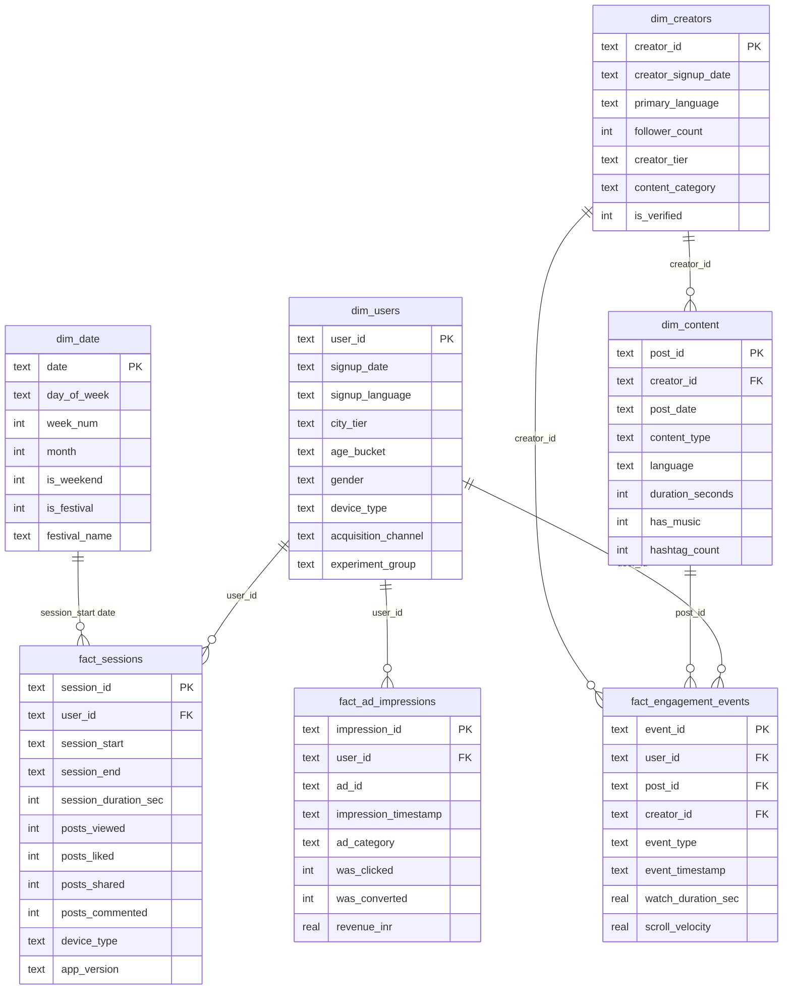

# Schema Diagram — ShareChat Analytics Warehouse

## Star Schema Overview

The warehouse uses a classic star schema: fact tables in the centre, dimension tables around the perimeter. This mirrors how a real Redshift analytics warehouse at ShareChat would be structured.

```
                         ┌─────────────┐
                         │  dim_date   │
                         │─────────────│
                         │ date (PK)   │
                         │ day_of_week │
                         │ week_num    │
                         │ month       │
                         │ is_weekend  │
                         │ is_festival │
                         │festival_name│
                         └──────┬──────┘
                                │ join on DATE(session_start)
                                │
          ┌─────────────────────┼─────────────────────────────────┐
          │                     │                                 │
  ┌───────┴────────┐    ┌───────┴──────────────┐    ┌────────────┴──────────┐
  │   dim_users    │    │   fact_sessions       │    │  fact_ad_impressions  │
  │────────────────│    │──────────────────────│    │───────────────────────│
  │ user_id (PK)   │◄───│ session_id (PK)       │    │ impression_id (PK)    │
  │ signup_date    │    │ user_id (FK)          │    │ user_id (FK) ─────────┤
  │ signup_language│    │ session_start         │    │ ad_id                 │
  │ city_tier      │    │ session_end           │    │ impression_timestamp  │
  │ age_bucket     │    │ session_duration_sec  │    │ ad_category           │
  │ gender         │    │ posts_viewed          │    │ was_clicked           │
  │ device_type    │    │ posts_liked           │    │ was_converted         │
  │ acquisition_ch │    │ posts_shared          │    │ revenue_inr           │
  │ experiment_grp │    │ posts_commented       │    └───────────────────────┘
  └───────┬────────┘    │ device_type           │
          │             │ app_version           │
          │ also FK in  └──────────────────────┘
          │ fact_engagement_events
          │
  ┌───────┴──────────────────────────────────────────────────────────────────┐
  │                        fact_engagement_events                             │
  │──────────────────────────────────────────────────────────────────────────│
  │ event_id (PK)  │ user_id (FK→dim_users)  │ post_id (FK→dim_content)     │
  │ creator_id (FK→dim_creators, DENORM)      │ event_type                  │
  │ event_timestamp │ watch_duration_sec       │ scroll_velocity             │
  └──────────────────────────────────────────────────────────────────────────┘
          │                                              │
          │ FK                                           │ FK
  ┌───────┴────────┐                           ┌────────┴──────────┐
  │  dim_creators  │◄──────────────────────────│   dim_content     │
  │────────────────│      creator_id FK        │───────────────────│
  │ creator_id (PK)│                           │ post_id (PK)      │
  │ creator_signup │                           │ creator_id (FK)   │
  │ primary_lang   │                           │ post_date         │
  │ follower_count │                           │ content_type      │
  │ creator_tier   │                           │ language          │
  │ content_category                           │ duration_seconds  │
  │ is_verified    │                           │ has_music         │
  └────────────────┘                           │ hashtag_count     │
                                               └───────────────────┘
```

## Mermaid Diagram (Render at mermaid.live)



## Design Decisions

### Why star schema?
Star schema optimises for analytical queries (GROUP BY, aggregations, multi-table joins) at the cost of some storage redundancy. In Redshift, this pattern minimises the number of large table joins (the expensive operation) because dimension tables are small enough to replicate to every compute node (DISTSTYLE ALL).

### Why denormalise creator_id into fact_engagement_events?
The most common query pattern on fact_engagement_events is:
```sql
WHERE creator_id = 'C_000123'  -- filter by creator
GROUP BY creator_id             -- aggregate by creator
```
Without the denormalised `creator_id`, every such query would require a JOIN through `dim_content`. By storing `creator_id` directly on the fact table, we trade ~8 bytes per row for a significant query performance win on 2M-row scans. This is a standard Redshift warehousing pattern.

### Index strategy (SQLite)
In the SQLite warehouse, indexes are created on:
- `fact_sessions`: `(user_id)`, `(session_start)`, `(device_type)`
- `fact_engagement_events`: `(user_id)`, `(post_id)`, `(creator_id)`, `(event_type)`, `(event_timestamp)`
- `fact_ad_impressions`: `(user_id)`, `(impression_timestamp)`, `(ad_category)`
- `dim_content`: `(creator_id)`, `(post_date)`, `(language)`
- `dim_users`: `(signup_date)`, `(city_tier)`, `(signup_language)`, `(experiment_group)`

In Redshift the equivalent would be SORTKEY (for range-scan on timestamp columns) and DISTKEY (for distributing fact tables by `user_id`).
